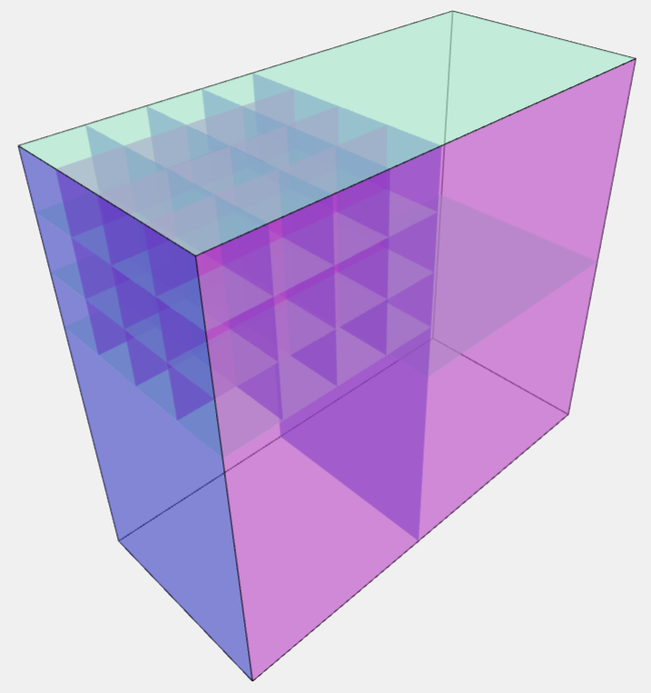
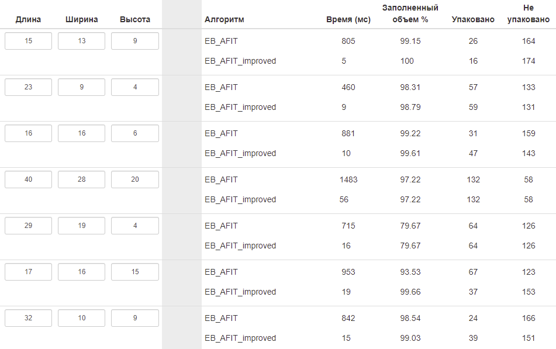

## `EB_AFIT_improved`

### Доработанный алгоритм, в нем решена пролема упаковки слоя в глубину, когда оставшееся свободное пространство не используется.

Предметы:
| Длина | Ширина | Высота | Количество |
| ----- | ------ | ------ | ---------- |
| 4     | 4      | 5      | 3          |
| 1     | 1      | 1      | 48         |

Контейнер:
| Длина | Ширина | Высота |
| ----- | ------ | ------ |
| 4     | 9      | 8      |

| EB_AFIT | EB_AFIT_improved |
| ----- | ------ |
|  |  |

### Увеличена производительность.




## `XYZRotationVertical`

### Вертикальная упаковка с вращением предметов в любой плоскости.

Может быть настроена таким образом, что бы не смешивать разные предметы один поверх другого.
```csharp
protected override bool SkipBoxBehind(int j) => itemsToPack[j].ID != itemsToPack[cboxi].ID;
```


## `WithoutRotation`

### Упаковка без вращения предметов.


## `ZRotation`

### Упаковка с вращением предметов в горизонтальной плоскости.


